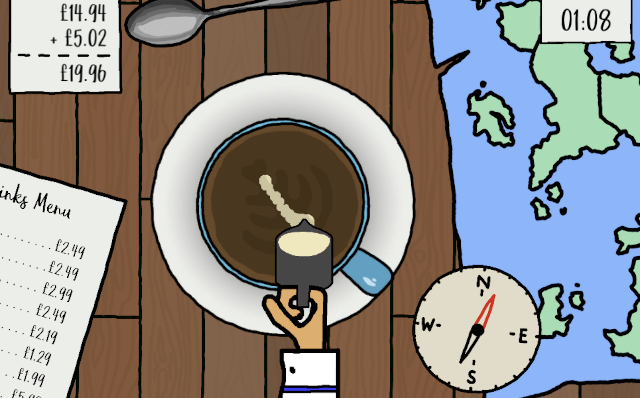
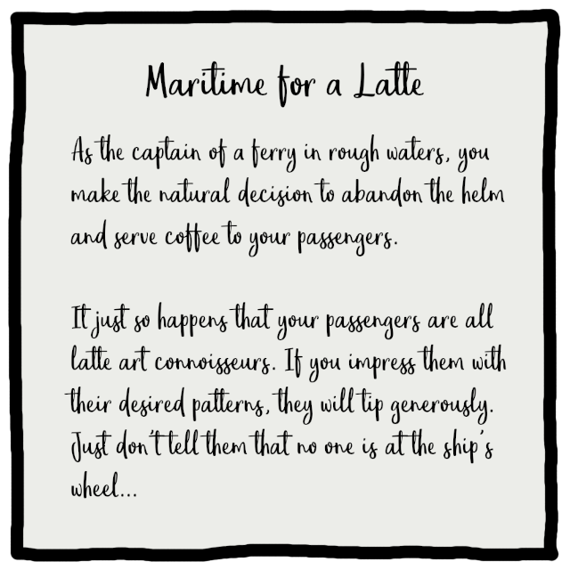

# maritime-for-a-latte

A 2D game created by @thebaristas for the 2021 [Ludum Dare 49](https://ldjam.com/) game jam based on the theme "Unstable".

## Try it out

A WebGL version of the game is available at: https://thebaristas.github.io/maritime-for-a-latte/.

You can also build the game yourself. To do this, clone the repository and open the root directory in Unity at version `2021.1.23f1`.

## The game

### Description

### Controls

| Key     | Action                |
| ------- | --------------------- |
| `Click` | Pour milk into coffee |
| `Space` | Serve latte           |
| `Esc`   | Pause                 |

## Built with

- [Unity](https://unity.com/) - Game Engine
- [Gimp](https://www.gimp.org/) - Artwork
- [Logic Pro](https://www.apple.com/logic-pro/) - Music
- [GitHub Pages](https://pages.github.com/) - Static Hosting

## License

[MIT license](./LICENSE)
